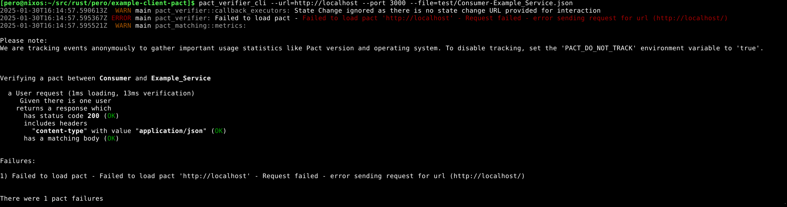

# example-client-pact


Rust example of how to use Contract testing in Rust.

Uses a Dummy Server :
*  https://github.com/perolo/example-server-pact

Inspiration from :
*  


This is my personal learning journey to NixOs, Embedded Rust and Pico development, no guarantees what so ever

## Getting Started


### Using Nix flake
```bash
nix develop
# Starting server
cd example-server-pact
cargo run &

cd example-client-pact
# Generate current pact
cargo test
# Compare to last stored reference
pact_verifier_cli --url=http://localhost --port 3000 --file=test/Consumer-Example_Service.json
# Compare to the latest generated
pact_verifier_cli --url=http://localhost --port 3000 --file=target/pact/Consumer-Example_Service.json

```
## Output
!



## License

Licensed under either of

- MIT license ([LICENSE-MIT](LICENSE-MIT) or http://opensource.org/licenses/MIT)


### Contribution

Unless you explicitly state otherwise, any contribution intentionally submitted for inclusion in the
work by you, as defined in the Apache-2.0 license, shall be dual licensed as above, without any
additional terms or conditions.

# Features

*   

## Backlog
* do not understnd problem:
  * ERROR main pact_verifier: Failed to load pact 

## Other references

* 